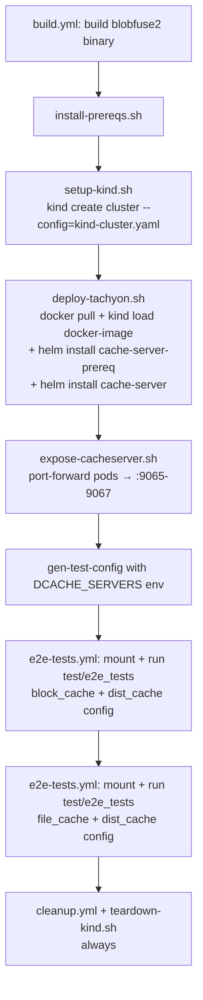

# Distributed Cache Nightly E2E — Integration Plan

Closes [component/dist_cache/TEST_PLAN.md](../../../component/dist_cache/TEST_PLAN.md) item **149** ("E2E tests with dist_cache config in nightly pipeline").

## Goal

Add a new stage to [blobfuse2-nightly.yaml](../../../blobfuse2-nightly.yaml) that stands up a real distributed cache (Tachyon) and runs the existing `test/e2e_tests` Go suite through a `dist_cache`-enabled blobfuse2 mount. Covers TEST_PLAN §4 (items 115–124).

## Key Decisions

### 1. Local Kubernetes: **kind**, not AKS, not minikube

**Not AKS**: the tests validated here are functional correctness, not perf. AKS provisioning cost and time have no matching signal benefit. Real-hardware perf work belongs in a separate pipeline.

**kind over minikube**: kind ([sigs.k8s.io/kind](https://kind.sigs.k8s.io/)) runs each Kubernetes node as a Docker container on the host's Docker daemon. Compared to minikube on the docker driver, this gives us:
- **No nested VM / no minikube-specific binary** — the only runtime dependency beyond `kubectl` / `helm` is Docker itself, which the `blobfuse-ubuntu-pool` agents already have.
- **Declarative multi-node cluster** in one YAML file (`kind create cluster --config=…`) instead of the sequential `minikube node add` loop that Tachyon's `create.sh` had to hedge with sleeps and CNI restart workarounds.
- **Faster cold start** (~30–60 s for 4 nodes vs. ~2–3 min for minikube), which matters when the stage is re-run for iteration even though it does not move the needle on a multi-hour nightly.
- **Native host-path prep** via `docker exec <node> mkdir …` — no `minikube ssh` shim, no dependency on the minikube profile being current.

**Divergence from Tachyon's published tooling is acknowledged and bounded.** The Tachyon team publishes for minikube:
- `~/vienna-tachyon/deploy/scripts/minikube/create.sh` — cluster creation
- `~/vienna-tachyon/deploy/scripts/minikube/load-images.sh` — `minikube image load`
- `.pipelines/templates/e2e-test-job.yml` — `make provision TARGET=minikube`

However the **Helm chart itself** (`~/vienna-tachyon/helm/cache-server/values.yaml`) is cluster-agnostic. Only three chart assumptions have to be satisfied by our substrate, and all three port cleanly to kind:
1. `useHostPath: true` with `hostPath: /var/lib/ssd/cacheserver` → satisfied by `docker exec kind-worker* mkdir -p /var/lib/ssd/cacheserver` (kind mounts a tmpfs-backed writable rootfs per node container).
2. `nodeSelector: singularity.azure.com/processing-unit: system` → satisfied by `kubectl label node …` after `kind create cluster`, identical to the minikube path.
3. Image side-loaded rather than pulled → `kind load docker-image ` replaces `minikube image load `.

The adapter surface we own for this divergence is ~40 lines across `setup-kind.sh` and one line in `deploy-tachyon.sh`. This is a smaller ongoing tax than pulling in the full minikube toolchain on every agent and living with its startup races.

### 2. Topology: cluster in kind, blobfuse2 mount on the pipeline host

- Cache pods run inside a kind cluster on the existing `blobfuse-ubuntu-pool` VM agent. Kind node containers run under the agent's Docker daemon; no extra VM.
- blobfuse2 mounts on the **host**, not in a pod. This lets the existing `test/e2e_tests` Go suite run unchanged via the existing [azure-pipeline-templates/e2e-tests.yml](../../../azure-pipeline-templates/e2e-tests.yml).
- Reachability from host → cache pods: one `kubectl port-forward pod/<name> <local>:9065` per cacheserver replica, mapped to ports `9065`, `9066`, `9067`. This yields a static `server-list: "localhost:9065,localhost:9066,localhost:9067"` — the exact pattern already used by [testdata/config/azure_key_dist_cache_block.yaml](../../../testdata/config/azure_key_dist_cache_block.yaml).
- Per-pod forwarding (not a single `svc` port-forward) is intentional so the client-side consistent-hash ring is genuinely exercised.
- kind exposes the API server on `127.0.0.1:<random>`; `kubectl port-forward` works identically to the minikube-docker-driver case, so no host-networking gymnastics are needed.

### 3. Dry-run first

The new stage is gated by a `dist_cache_test` pipeline parameter defaulting to `false`. Scheduled nightly runs are unaffected until the parameter default is flipped after 2–3 successful manual runs.

### 4. Tachyon image + chart both sourced from ACR (no source checkout)

The Tachyon repo does not publish images to MCR (verified against `~/vienna-tachyon/.pipelines/`). Both the container image *and* the Helm chart come from an internal, OCI-enabled ACR:

Image:
- `CACHE_SERVER_IMAGE_REGISTRY` — ACR hostname (**TBD** — user to provide)
- `CACHE_SERVER_IMAGE_REPO` — defaults to `cache-server`
- `CACHE_SERVER_IMAGE_TAG` — exact tag (**TBD** — user to provide)

Chart (pulled via `helm install oci://<registry>/<repo> --version <ver>`):
- `CACHE_SERVER_CHART_REGISTRY` — defaults to `CACHE_SERVER_IMAGE_REGISTRY` (override only if the chart lives in a different ACR)
- `CACHE_SERVER_CHART_REPO` — defaults to `charts/cache-server`
- `CACHE_SERVER_PREREQ_CHART_REPO` — defaults to `charts/cache-server-prereq` (CRDs / RBAC / cluster-scoped resources the main chart depends on; installed first, pinned to the same version)
- `CACHE_SERVER_CHART_VERSION` — exact chart version (**TBD** — user to provide)

Scripts fail fast with a clear error if any of the TBDs are empty. Consuming the chart over OCI removes the need for a `vienna-tachyon` source checkout and its ADO `resources.repositories` entry — the pipeline only needs the ACR access it already needs for the image `docker pull`. Helm 3.8+ has OCI support built in; `install-prereqs.sh` installs a fresh Helm.

## Scope

**In this PR**
- TEST_PLAN §4.1 (items 115–119) — `block_cache + dist_cache + azstorage` mount, existing E2E suite
- TEST_PLAN §4.2 (items 120–124) — `file_cache + dist_cache + azstorage` mount, existing E2E suite
- Closes TEST_PLAN §7 item 149

**Out of scope (follow-ups)**
- TEST_PLAN §5 (E2E-1 … E2E-27) — needs a new `test/dcache_e2e/` Go package for cross-node / fault-injection scenarios
- TEST_PLAN §6 (perf benchmarks) — belongs in `blobfuse2-perf.yaml`, needs real hardware for meaningful numbers
- TEST_PLAN §7 item 150 (perf regression) — depends on §6
- TEST_PLAN §7 item 151 ARM64 for dist_cache E2E — additive matrix row later

## Deliverables

Files created under this branch (`nearora/e2eTests`):

| File | Purpose |
|---|---|
| [test/scripts/dcache/config/nightly.config](config/nightly.config) | Shared bash config (cluster size, image coords, ports, replica count) |
| [test/scripts/dcache/install-prereqs.sh](install-prereqs.sh) | Idempotent installer for docker-ce / kind / kubectl / helm |
| [test/scripts/dcache/setup-kind.sh](setup-kind.sh) | Create a 4-node kind cluster from a declarative `kind-cluster.yaml`, label all nodes, prepare `/var/lib/ssd/cacheserver` on each node via `docker exec` |
| [test/scripts/dcache/kind-cluster.yaml](kind-cluster.yaml) | `kind` `Cluster` config: 1 control-plane + 3 workers, kubeadm patches if needed |
| [test/scripts/dcache/deploy-tachyon.sh](deploy-tachyon.sh) | `docker pull` + `kind load docker-image` + `helm install` of `cache-server-prereq` then `cache-server` from `oci://<CACHE_SERVER_CHART_REGISTRY>/...` |
| [test/scripts/dcache/expose-cacheserver.sh](expose-cacheserver.sh) | Per-pod `kubectl port-forward` on 9065/9066/9067; writes server list + PID file |
| [test/scripts/dcache/teardown-kind.sh](teardown-kind.sh) | Best-effort cleanup (kill port-forwards, `helm uninstall`, `kind delete cluster`) |
| [test/scripts/dcache/README.md](README.md) | Local run instructions for operators |
| [testdata/config/azure_key_dist_cache_block_e2e.yaml](../../../testdata/config/azure_key_dist_cache_block_e2e.yaml) | `gen-test-config` template for `block_cache + dist_cache` |
| [testdata/config/azure_key_dist_cache_file_e2e.yaml](../../../testdata/config/azure_key_dist_cache_file_e2e.yaml) | `gen-test-config` template for `file_cache + dist_cache` |
| [azure-pipeline-templates/dist-cache-e2e.yml](../../../azure-pipeline-templates/dist-cache-e2e.yml) | ADO template: prereqs → cluster → deploy → expose → generate config → delegate to `e2e-tests.yml` → teardown (always) |

Files modified:

| File | Change |
|---|---|
| [blobfuse2-nightly.yaml](../../../blobfuse2-nightly.yaml) | New `dist_cache_test` parameter (default `false`); new `DistCacheValidation` stage depending on `BuildAndTest`; ACR image + chart coordinate variables (TBD) |

## Pipeline Flow (per `DistCacheValidation` job)

## Prerequisites Before First Manual Run

1. Populate the ACR coordinates — `CACHE_SERVER_IMAGE_REGISTRY`, `CACHE_SERVER_IMAGE_TAG`, and `CACHE_SERVER_CHART_VERSION` — either as pipeline variables on the new stage or in the `NightlyBlobFuse` variable group. Also set `CACHE_SERVER_CHART_REGISTRY` if the chart lives in a different ACR from the image.
2. Grant the blobfuse2 pipeline pull access to the ACR (agent's docker credential chain must be able to `docker pull` the image; Helm reuses the same credential chain for `oci://` pulls after `az acr login` / `helm registry login`). If the ACR is not anonymous, either pre-`az acr login` on the agent or add a `helm registry login` step at the top of `dist-cache-e2e.yml`.
3. Confirm the `blobfuse-ubuntu-pool` agents have ≥100 GB free on the volume backing Docker's data-root (kind stores node container filesystems there). If Docker's data-root is on `/`, either relocate it (`/etc/docker/daemon.json` → `"data-root": "/mnt/docker"`) or ensure `/` has the headroom. Nothing in the kind flow needs `MINIKUBE_HOME`.
4. Queue a manual run of `blobfuse2-nightly` with `dist_cache_test: true`.

## Enablement Checklist

- [ ] Manual run 1 green
- [ ] Manual run 2 green
- [ ] Manual run 3 green
- [ ] Flip `dist_cache_test` default from `false` → `true` in [blobfuse2-nightly.yaml](../../../blobfuse2-nightly.yaml)
- [ ] Mark item **149** ✅ Implemented in [component/dist_cache/TEST_PLAN.md](../../../component/dist_cache/TEST_PLAN.md)
